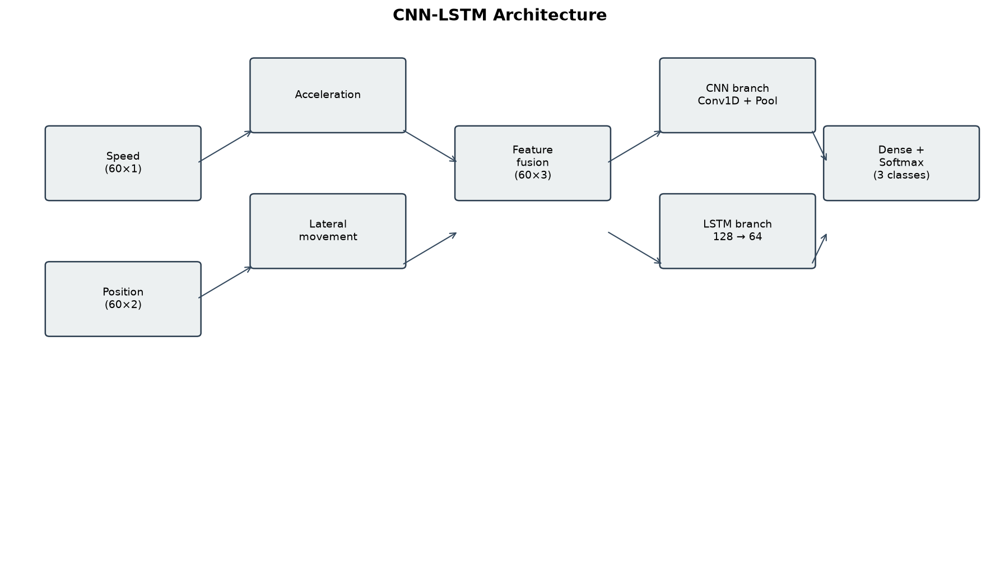
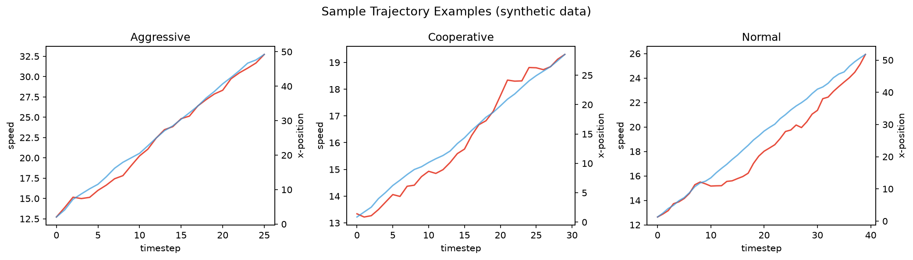
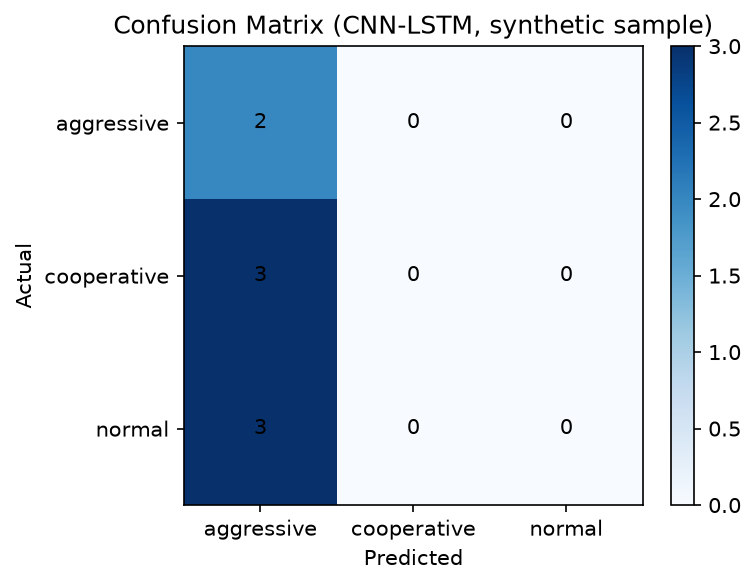
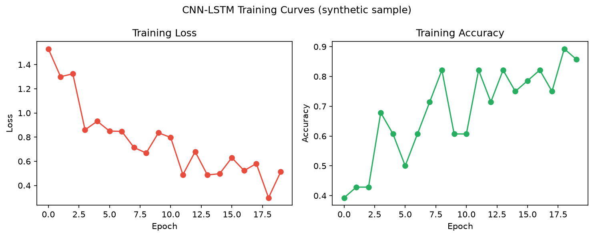

# Vehicle Trajectory Behavior Classifier

**CNN-LSTM pipeline for classifying driving behavior from vehicle speed and position time series.**

Classifies simulated Abu Dhabi traffic trajectories into **aggressive**, **cooperative**, and **normal** behavior using speed and position time series from Aimsun micro-simulation output.

## Quick Start

```bash
git clone https://github.com/CatalinMoldova/vehicle-trajectory-behavior-classifier.git
cd vehicle-trajectory-behavior-classifier
bash scripts/setup_env.sh
source .venv/bin/activate
```

Train, evaluate, and predict:

```bash
# Train one model
python -m vehicle_behavior.train --config configs/default.yaml --model cnn_lstm

# Train all baselines
bash scripts/train_all_models.sh

# Evaluate
python -m vehicle_behavior.evaluate --model artifacts/cnn_lstm.keras

# Predict
python -m vehicle_behavior.predict --input data/sample/sample_trajectories.csv --model artifacts/logistic_regression.joblib

# Test
pytest
```

In Cursor/VS Code, select the interpreter at `.venv/bin/python`.

## Results (synthetic sample data)

Metrics below were produced on the included synthetic sample (`data/sample/sample_trajectories.csv`). Deep learning models underperform here because the dataset is small (36 trajectories); classical baselines fit this demo data more easily. Re-run on full Aimsun/Box data for production-grade evaluation.

| Model | Accuracy | Macro F1 | Weighted F1 | Notes |
|---|---:|---:|---:|---|
| Logistic Regression | 1.000 | 1.000 | 1.000 | Baseline on engineered features |
| Random Forest | 1.000 | 1.000 | 1.000 | Non-deep-learning baseline |
| LSTM | 1.000 | 1.000 | 1.000 | Sequence baseline |
| CNN-LSTM | 0.250 | 0.133 | 0.100 | Main model (needs more data) |









## Project Structure

```text
vehicle-trajectory-behavior-classifier/
├── README.md
├── LICENSE
├── requirements.txt
├── pyproject.toml
├── configs/default.yaml
├── scripts/
│   ├── setup_env.sh
│   ├── generate_sample_data.py
│   ├── generate_assets.py
│   └── train_all_models.sh
├── src/vehicle_behavior/     # reusable package
├── notebooks/
│   ├── 01_exploratory_trajectory_analysis.ipynb
│   ├── 02_rate_limited_batch_trainer.ipynb
│   └── 03_continuous_learning_pipeline.ipynb
├── data/
│   ├── README.md
│   └── sample/sample_trajectories.csv
├── results/                  # metrics, reports
├── assets/                   # figures for README
└── tests/
```

## Model Architecture

Hybrid **CNN-LSTM** ingests:

- Vehicle **speed** time series (`N × sequence_length × 1`)
- Vehicle **position** time series (`N × sequence_length × 2`)

Internal features: acceleration (speed differences) and lateral movement (frame-to-frame displacement). CNN and LSTM branches are fused, then dense layers output a 3-class softmax.

Configurable via `configs/default.yaml`.

## Data

The original Aimsun/Box dataset is **private** and not included. A synthetic sample is provided so the pipeline runs end-to-end without credentials.

For private research data (NYU Box):

1. Place `key.json` in the project root (never commit it).
2. Use notebooks in `notebooks/` for Box API and Google Drive workflows.

```python
from boxsdk import Client, JWTAuth
auth = JWTAuth.from_settings_file("key.json")
client = Client(auth)
```

## Notebooks

| Notebook | Purpose |
|---|---|
| `01_exploratory_trajectory_analysis.ipynb` | EDA on sample trajectories |
| `02_rate_limited_batch_trainer.ipynb` | Rate-limited Box batch training (Colab) |
| `03_continuous_learning_pipeline.ipynb` | Incremental learning from Box streams |

Research notebooks import shared logic from `vehicle_behavior` where possible.

## Development

```bash
source .venv/bin/activate
pytest
bash scripts/generate_assets.py   # regenerate README figures
```

CI runs on push via GitHub Actions (`.github/workflows/ci.yml`).

## Research Context

Supports high-resolution traffic modeling and behavior recognition for Abu Dhabi arterial network research. Future work: integrate real-world ITS sensor data.

## Contact

**Catalin Botezat** — Abu Dhabi Traffic Flow Modeling Research — cb5330@nyu.edu
